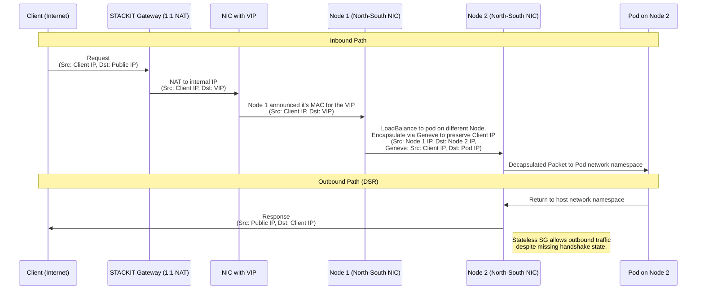

# Architecture

This document outlines the network configuration and traffic flow for Kubernetes nodes and services within the STACKIT infrastructure, focusing on the dual-NIC setup and Direct Server Return (DSR) implementation.

## Dual NIC Configuration

Each Kubernetes node is equipped with two Network Interface Cards (NICs) to isolate traffic types and simplify management:

* **NIC 1 (East-West):** Dedicated to internal pod-to-pod and pod-to-service communication.
* **NIC 2 (North-South):** Dedicated to external traffic (ingress/egress) to Kubernetes Services of type `LoadBalancer`.

## North-South Traffic & Direct Server Return (DSR)

The North-South network utilizes **stateless security groups** to support Direct Server Return.

* **The Problem:** In a standard stateful network underlay, return traffic from a pod directly to a client would be dropped. This occurs because the underlay does not see the full TCP handshake (it misses the initial ACK or the symmetric path), leading it to categorize the outbound response as unsolicited.
* **The Solution:** Stateless security groups bypass this connection tracking, allowing the return path to function correctly.
* **Geneve Encapsulation:** To ensure the pod remains aware of the original **Client IP**, Geneve encapsulation is used to wrap the traffic from the entry point to the node hosting the pod. This

### Traffic Flow Diagram (DSR)

## Network Isolation & Routing

NICs are placed in separate networks for two primary reasons:

1. **Traffic Distinction:** Easily distinguish between internal cluster traffic and external service traffic.
2. **Simplified Routing:** This separation avoids the need for complex policy-based routing rules within the Linux kernel, as each NIC handles a specific, isolated scope of traffic.

## Kubernetes Service Implementation

For every Kubernetes Service defined in the cluster, the following infrastructure components are orchestrated:

* **Routable VIP:** A NIC is created within the STACKIT network to represent a routable Virtual IP (VIP).
* **1:1 NAT:** A Public IP is attached to this internal NIC, providing a direct 1:1 NAT mapping to the internet.
* **Allowed Addresses:** The North-South NIC of every node is updated to include the VIP in its **Allowed Addresses** list. This configuration is essential to permit the NIC to accept and process traffic for an IP address that is not its primary assigned address.

## Cilium & Leader Election

**Cilium** acts as the primary networking agent and performs the following roles:

* **VIP Announcement:** Cilium announces the VIP within the North-South network to ensure traffic is correctly routed to the active nodes.
* **LoadBalancing:** Cilium loadbalances the traffic using it's kube-proxy-replacement feature to healthy pods in the cluster.
* **Orchestration:** It uses **Kubernetes Leases** to manage leader election, ensuring that a specific node is designated as the primary handler for specific VIP traffic, preventing conflicts and ensuring high availability.
